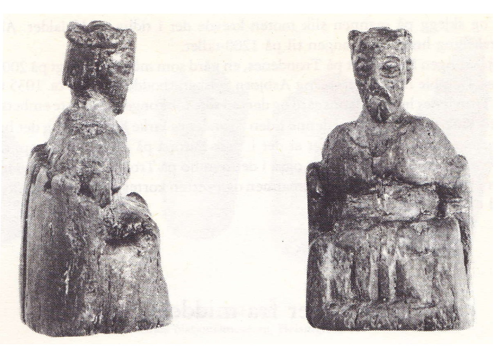
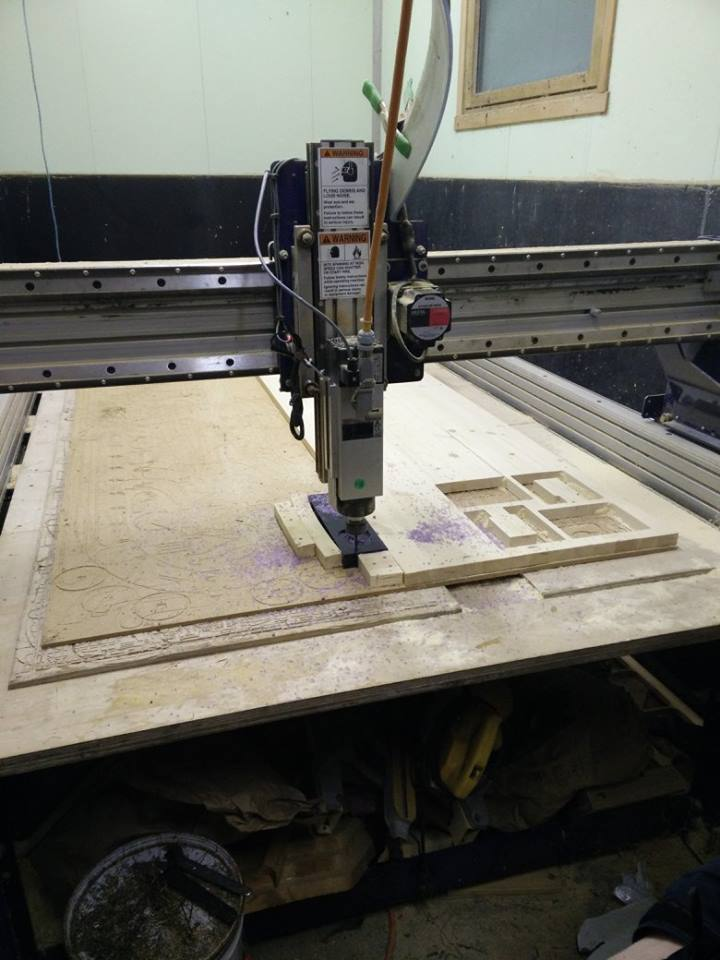
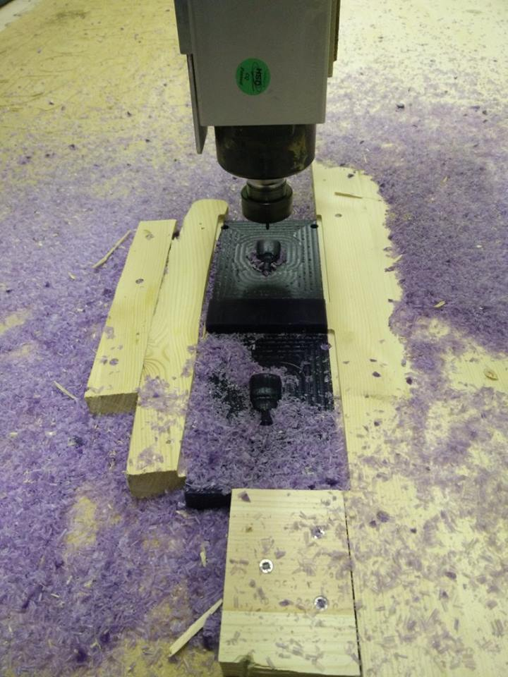
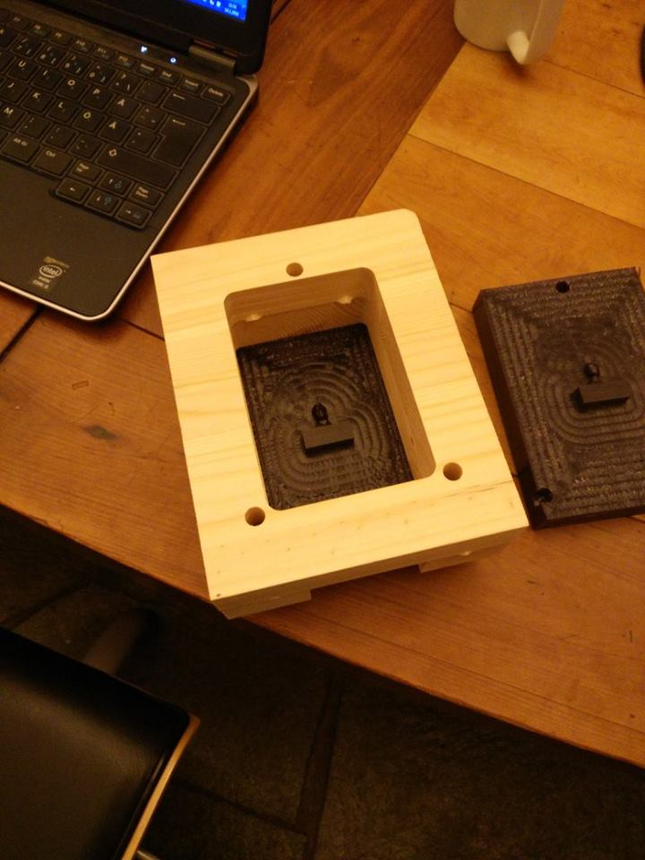
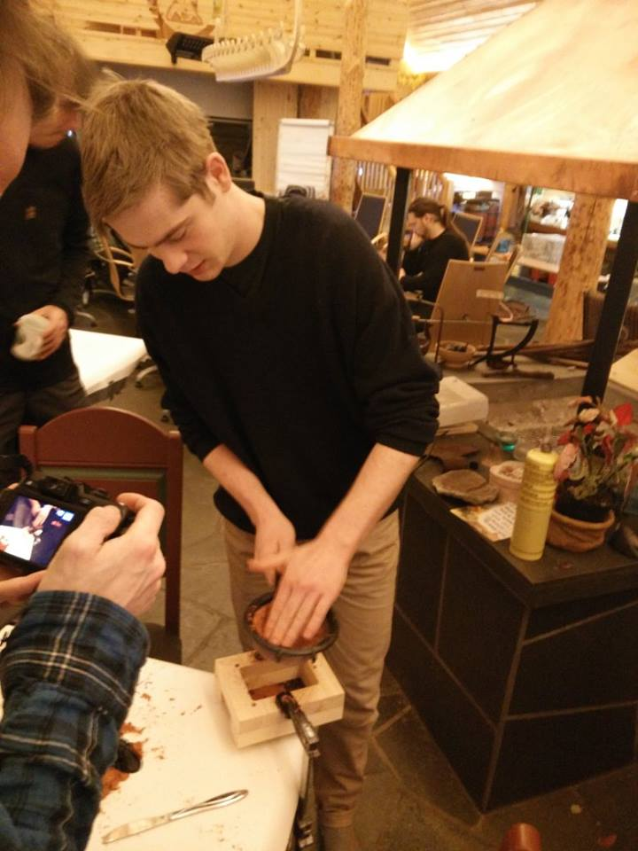
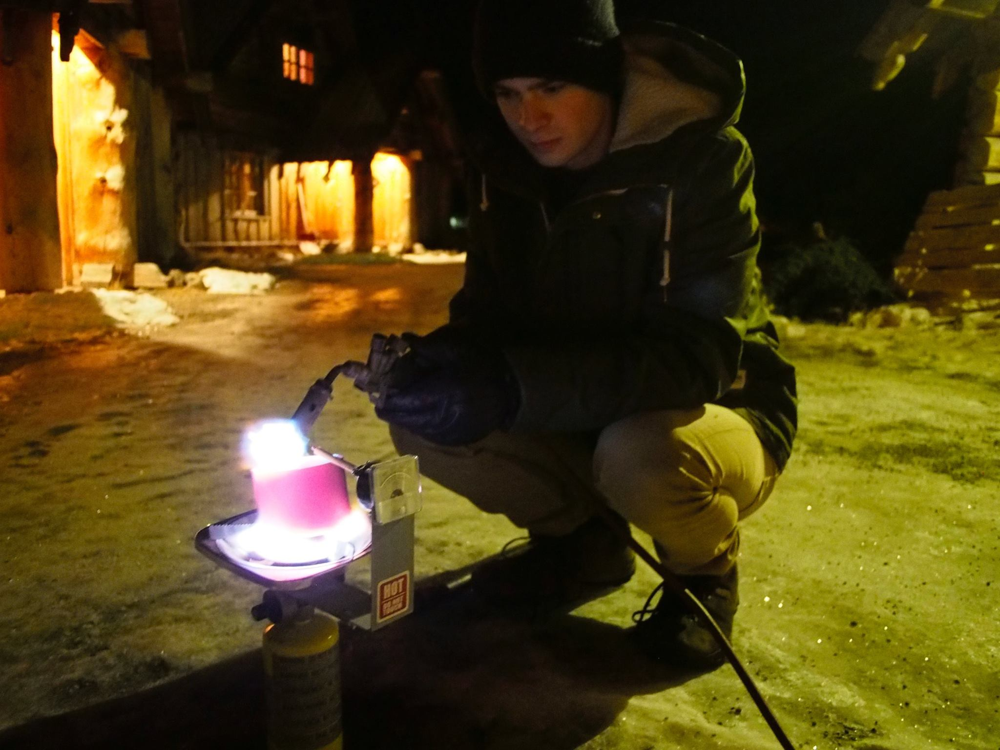

# Sand casting frames and 3D milled molds

A workflow test for sand casting metal in a Fab Lab. Developed during the [Nordic Fab Lab bootcamp 2016](https://www.facebook.com/events/1499170763717712/) at [MIT Fab Lab Lyngen](www.fablab.no), January 12-14 20116.

Casting by Torbjørn Helgesen. Frame system by Jens Dyvik. Molds by Frosti Gislason, Jani Ylioja and Jens Dyvik

We used the Sakko king as a first test object. It is a 800 year old game piece from the ancient Viking board game Sakko. More

